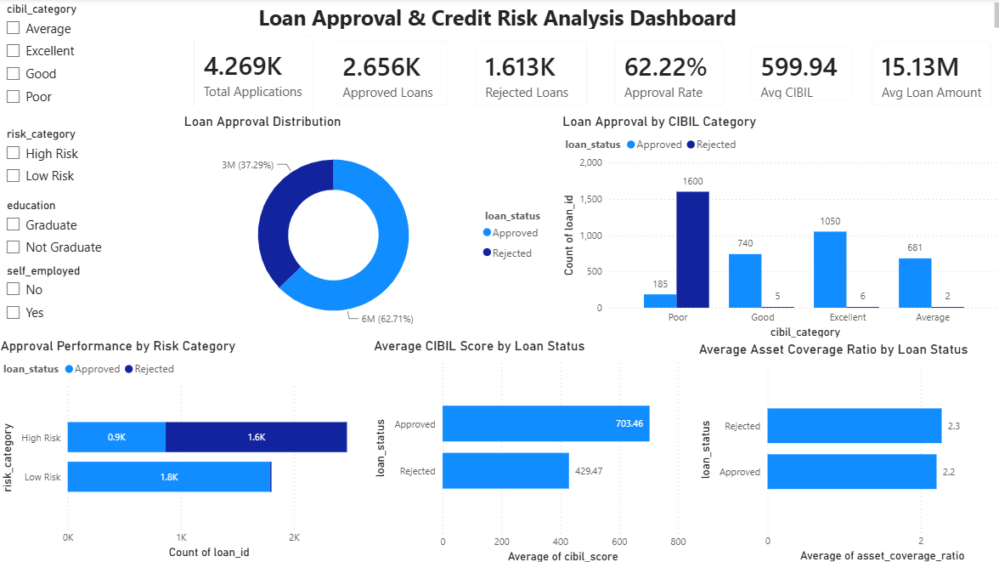

# 🏦 Loan Approval & Credit Risk Analysis Dashboard

_Analyzing loan application data to understand approval patterns, evaluate credit risk, and identify the key factors influencing lending decisions using Excel, MySQL, and Power BI._

---

## 📌 Table of Contents
- <a href="#overview">Overview</a>
- <a href="#business-problem">Business Problem</a>
- <a href="#dataset">Dataset</a>
- <a href="#tools--technologies">Tools & Technologies</a>
- <a href="#data-preparation">Data Preparation</a>
- <a href="#analysis--key-findings">Analysis & Key Findings</a>
- <a href="#sql-queries">SQL Queries</a>
- <a href="#dashboard">Dashboard</a>
- <a href="#final-recommendations">Final Recommendations</a>
- <a href="#author--contact">Author & Contact</a>

---

<h2>Overview</h2>

This project analyzes loan applications and credit risk factors to understand what drives loan approval and rejection decisions.

The analysis focuses on applicant creditworthiness, risk categories, asset strength, and loan characteristics to uncover approval trends and support data-driven lending strategies.

---

<h2>Business Problem</h2>

Financial institutions must balance loan growth with credit risk management. Approving high-risk applicants can increase default rates, while rejecting too many applicants can reduce business opportunities. This project aims to:
- Analyze overall loan approval performance
- Evaluate the impact of CIBIL scores on approvals
- Identify high-risk and low-risk customer segments
- Understand approval behavior across applicant categories
- Generate actionable recommendations for better lending decisions

---

<h2>Dataset</h2>

- Dataset used in this project: [Dataset Link](https://www.kaggle.com/datasets/architsharma01/loan-approval-prediction-dataset)

---

<h2>Tools & Technologies</h2>

- Excel (Data Cleaning & Feature Engineering)
- MySQL (Data Analysis & KPI Queries)
- Power BI (Dashboard Development & Visualization)

---

<h2>Data Preparation</h2>

The dataset was cleaned and transformed using Excel before analysis.

### Feature Engineering

The following business metrics were created:
- CIBIL Category
- Risk Category
- Loan Size Category
- Asset Coverage Ratio
- Income-to-Loan Ratio

### Data Validation

- Checked for missing values
- Verified duplicate records
- Standardized categorical values
- Validated calculated fields
- Trimmed inconsistent text values to ensure accurate analysis

---

<h2>Analysis & Key Findings</h2>

1. **Loan Portfolio Performance**: The dataset contains **4,269 loan applications**, out of which **2,656 loans were approved** and **1,613 loans were rejected**, resulting in an overall approval rate of **62.22%**
2. **Credit Score is the Strongest Approval Driver**: Approved applicants recorded an average CIBIL score of approximately **703**, while rejected applicants averaged approximately **429**, indicating a significant relationship between creditworthiness and approval decisions
3. **Poor Credit Profiles Face Higher Rejections**: Applicants categorized under the **Poor CIBIL** segment contributed the highest number of rejected applications, making them the primary risk group within the portfolio
4. **Excellent and Good Credit Segments Show Strong Approval Rates**: Customers with higher credit scores experienced substantially better approval outcomes, highlighting the importance of maintaining strong credit health
5. **Low-Risk Customers Dominate Approved Loans**: Most approved applications belong to the **Low-Risk** category, while the majority of rejected applications fall under **High-Risk** profiles
6. **Asset Coverage Ratio Shows Limited Influence**: Average asset coverage remained relatively similar between approved and rejected applicants, suggesting that credit score and risk profile have greater influence on lending decisions

---

<h2>
SQL Queries</h2>

All SQL queries used for analysis:  
[View SQL Queries](sql/loan_analysis_queries.sql)

---

<h2>Dashboard</h2>

The Power BI dashboard provides insights into:
- Loan Approval Distribution
- Approval Performance by Risk Category
- Loan Approval by CIBIL Category
- Average CIBIL Score by Loan Status
- Asset Coverage Analysis
- Interactive Filtering by Education, Risk Category, Employment Status, and Credit Category

---

<h2>Final Recommendations</h2>

- Strengthen credit-score-based lending policies to reduce default risk
- Implement risk-based pricing strategies for medium-risk applicants instead of outright rejection
- Prioritize low-risk customer segments for portfolio expansion
- Introduce additional behavioral and financial indicators to improve risk assessment models
- Continuously monitor approval trends and credit quality metrics through automated dashboards

---

<h2>Author & Contact</h2>

**Arnav Jha**
Data Analyst
- 🛠️ Skills: SQL, Excel, Power BI, MySQL, Data Analysis, Business Intelligence
- 🔗 LinkedIn: (https://www.linkedin.com/in/arnavkumarjha/)
- 🐙 GitHub: (https://github.com/arnavjha-3112)
